# rada

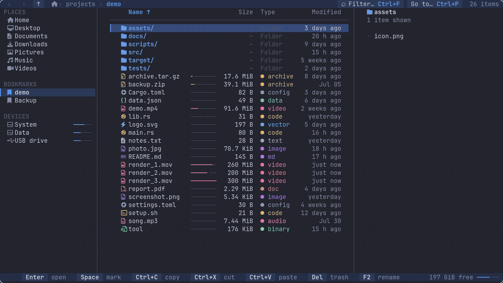

**A safe harbor for your files.**

rada is a fast file manager for the terminal, written in Rust, driven by keyboard or mouse. It is built around three promises:

1. **Plan first.** Every operation on files shows a *plan* before anything is touched: what will be done, how many files and bytes, and warnings about symlinks, permissions and name conflicts. You confirm, or you don't.
2. **Undo always.** Every operation that finishes is recorded in a persistent journal and can be undone, even after a restart or a crash. If a file was modified after the operation, undo leaves it alone and tells you, instead of overwriting it.
3. **Robust by construction.** Progress is counted in bytes. A failure on one file never stops the rest: you choose to skip, retry or abort, and the message always carries the full path. Symlinks stay symlinks (even broken or circular ones), nothing follows a link out of the tree, and a half-written file never appears under its final name.

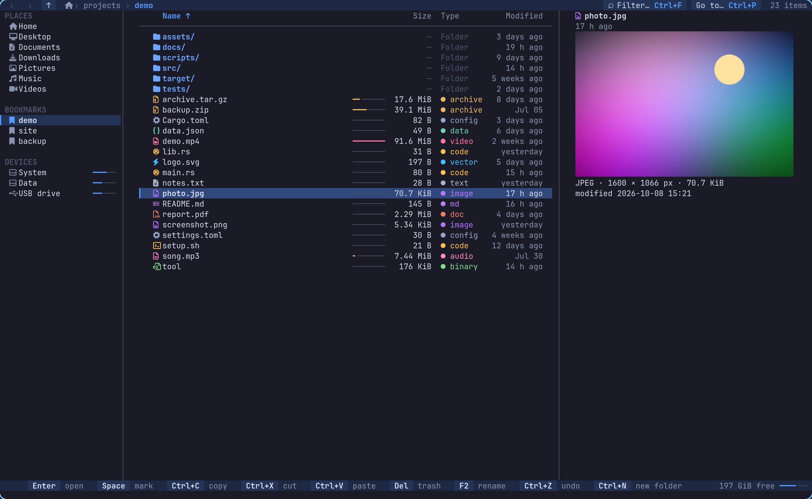

## Status

Version 0.4.0. **Linux is supported.** Windows and macOS are in development: the code is structured for them and compiles, but they are not supported yet and the attribute-preserving parts of a copy are stubs there.

rada is young and written by one person. The parts that touch your files — planning, copying, the journal, undo — are covered by unit tests, fault-injection tests (full disk, revoked rights, files that change or vanish), tests that kill the process with `SIGKILL` in the middle of an operation, and property tests that generate random trees and check that copy → undo and move → undo give back exactly the starting state, and that compress → extract gives back the same tree. That is a lot more than nothing and much less than years of use. Read [what is guaranteed and what is not](docs/SAFETY.md), keep backups of what matters, and please report anything strange. Review of the operations engine by other people is the help the project needs most ([CONTRIBUTING.md](CONTRIBUTING.md)).

## Why it is different

| | |
|---|---|
| **Looks like what you know** | Tabs on top, an address bar with clickable segments (type a path with `Ctrl+L`, with completion), a command bar (New, Cut, Copy, Paste, Rename, Compress, Delete, Sort, View and *Undo · copy of 3 items*), a navigation pane (Home, pinned folders, disks with how full they are, Trash), the folder as a table with checkboxes and plain-English types ("JPEG image", "Archive (tar.gz)") or as a grid of icons, a details pane with a big preview and the properties, a status bar and a row of key hints. Floating windows (plan, errors, prompts, jump palette) appear in the middle over a dimmed background; notifications come and go by themselves. It adapts to the terminal: below 140 columns the details pane steps aside, below 100 the buttons lose their words and the Type column goes, below 60 only name and size remain; on a short terminal the hints go first, then the command bar. Names with CJK, emoji or very long text stay aligned and are cut with `…`. |
| **Keyboard *and* mouse** | Vim keys and the usual desktop shortcuts work together by default (`y` or `Ctrl+C`, `d` or `Del`, `u` or `Ctrl+Z`…). The mouse selects, opens, scrolls, sorts by column, goes back and forward, picks places in the sidebar, and a right click opens a context menu that shows each shortcut. Every key can be rebound. |
| **Plan window** | Copy, move, rename, bulk rename, new folder, trash, delete: all show a plan with totals and warnings first. Permanent deletion states clearly that it cannot be undone and asks you to type `yes`. |
| **Journal + undo** | `u` undoes the last operation (with its own plan, so you see what undo will do). `U` shows the history. Undo of a copy removes exactly what the copy created; undo of a move moves back; undo of trash restores from the trash; undo of an overwrite brings the old file back. |
| **Per-file errors** | One unreadable file does not abort a 10,000-file copy. Errors are handled per step: skip / skip all / retry / abort. |
| **Byte progress** | A real progress bar with throughput and ETA, not "3 of 4 items". |
| **Faithful copies** | A copy keeps permissions (including setuid/setgid/sticky), times, extended attributes, POSIX ACLs, owner and group when the system allows, hard links between the files you copy together, and the holes of sparse files (progress counts real bytes). Before you confirm, the plan lists what the destination cannot hold (a FAT drive has no owners or ACLs); afterwards the result window lists anything that could not be kept. |
| **Survives a crash** | Every journal record reaches the operating system as it is written. If rada is killed in the middle of an operation, the next start removes the half-written file, keeps both copies of a move that was cut, and tells you; undo still works. See [docs/SAFETY.md](docs/SAFETY.md). |
| **Safe across filesystems** | Moves between filesystems are copy → verify (checksum of what was written) → remove source, file by file; the source is never deleted for something that failed to copy. Trashing follows the freedesktop.org specification, including per-device trash directories. |
| **Live** | The folder view updates by itself (inotify via `notify`), with debouncing. Sorting is stable and deterministic and applies instantly. |
| **Nothing blocks the UI** | All I/O happens in worker threads; the interface thread only draws and handles keys. Volumes are listed by a worker, never on a keypress, with a timeout per mount so a hung network share cannot freeze anything. |
| **Real image previews** | PNG, JPEG (with EXIF rotation), GIF (first frame), WebP, BMP and SVG are drawn with the best protocol the terminal offers: Kitty graphics (Ghostty, kitty), iTerm2 images (WezTerm, iTerm2), Sixel (foot), or coloured half blocks everywhere else. Decoding and resizing run in worker threads, so browsing a folder of photos never delays a keypress. Below the picture: format, pixel size, weight and date. Images that are too big are refused from the header alone, with a clear message. |
| **PDF previews** | The first page of a PDF is drawn like an image, with page count, title and author below it. It needs poppler (`pdftoppm`, `pdfinfo`; `pdftotext` for a text fallback): without it you get the text of the first page and a hint on how to install it. Password-protected and damaged files say so. Drawing runs in a worker with a time limit and is stopped the moment you move to another file; pages are cached in `$XDG_CACHE_HOME/rada/previews` and pruned by age and size. |
| **Archives** | `Enter` on a zip, tar (`.gz` `.bz2` `.xz` `.zst`), 7z or RAR opens it like a read-only folder; the path reads `photos.zip › 2024`, and text and pictures inside are previewed. Extract here or into a folder, or compress a selection, always with a plan, byte progress, cancel and undo. Paths that climb out of the destination, links that lead out, password-protected files and decompression bombs are stopped or confirmed first. See [Archives](#archives). |
| **Real disks only** | The sidebar lists real disks, partitions, removable drives and network shares, not `tmpfs`, `proc`, `binderfs`, snap loops, bind-mount duplicates or `/boot/efi`. The list is configurable (`[devices] hide`). |
| **Binary files get a card** | Instead of a wall of hex: file type, size, dates, permissions and, for executables, the architecture (ELF, PE and Mach-O are read from the header, never run). The hex dump is one key away (`H`). |
| **Hostile names are harmless** | Newlines, escape sequences, bidi controls and invalid UTF-8 in file names are shown as visible escapes. Paths are `Path`/`OsString` everywhere, never text. |

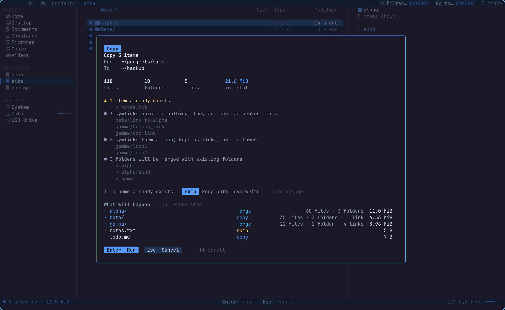

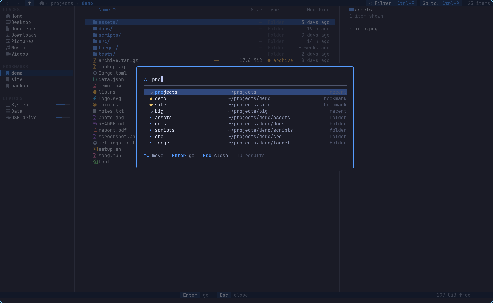

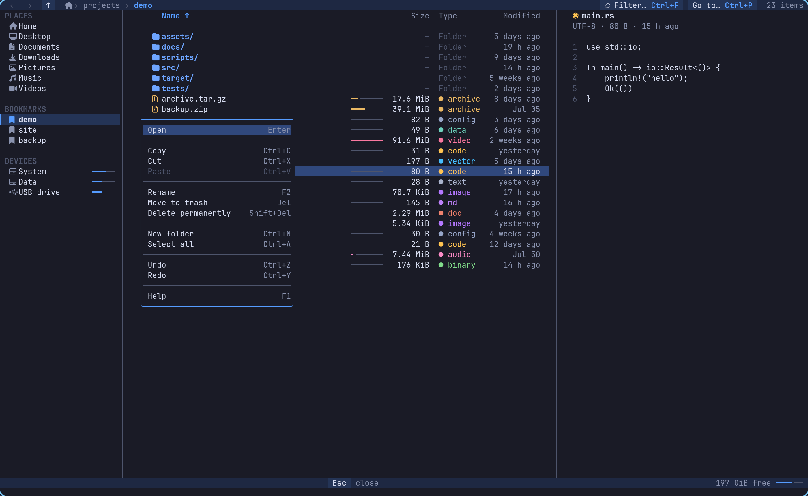

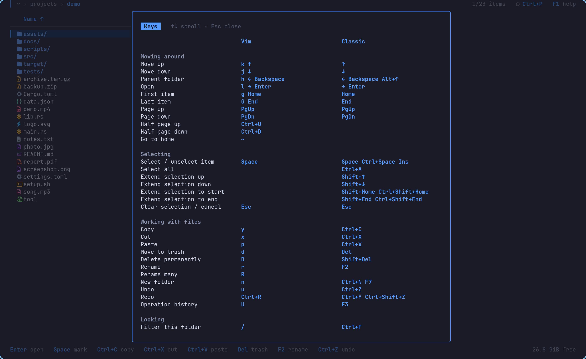

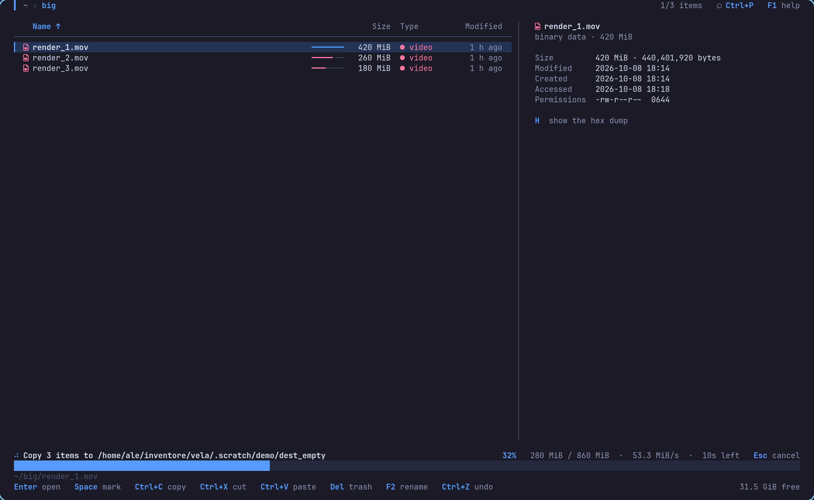

## Install

From source. You need Linux and a Rust toolchain of version 1.92 or newer ([rustup](https://rustup.rs)).

```sh
git clone https://github.com/formikadesk/rada-fm rada
cd rada
cargo install --path crates/rada
```

Or just build it: `cargo build --release` and use `target/release/rada`.

A [Nerd Font](https://www.nerdfonts.com/) in your terminal is recommended: rada then shows file-type icons. It looks for the font in the configuration of Ghostty, kitty, WezTerm, Alacritty and foot; otherwise it uses plain Unicode markers (`--icons nerd|unicode|none` overrides).

Optional: make your shell follow rada's last folder (`v` instead of `rada`):

```sh
eval "$(rada --init bash)"        # also: zsh, fish, nushell, powershell
```

Optional: add rada to your application menu, see [Desktop integration](#desktop-integration).

## First steps

```sh
rada                 # open the current folder
rada ~/Pictures      # open a folder
rada photo.png       # open its folder with the cursor on the file
```

Move with `j` `k` or the arrow keys, open with `Enter`, go up with `Backspace` (`Alt+↑` anywhere). Press `?` (or `F1`) for the full list of keys, `Ctrl+P` to jump to any folder, bookmark or disk. `Alt+←` and `Alt+→` go back and forward like in a browser; `Tab` moves into the sidebar of places. Select with `Space`, then copy (`Ctrl+C`), move to another folder and paste (`Ctrl+V`): a **plan** appears first, and nothing happens until you press `Enter`. Changed your mind afterwards? `Ctrl+Z` undoes it.

## Usage

```sh
rada [PATH] [--icons nerd|unicode|none] [--theme NAME] [--appearance auto|light|dark] [--keymap PRESET] [--no-mouse] [--hidden]
```

Icons default to plain Unicode markers. With a [Nerd Font](https://www.nerdfonts.com/) installed, use `--icons nerd` (or `icons = "nerd"` in the config file).

Open a file instead of a folder (`rada photo.png`) and rada starts in its folder with the cursor on it.

### Images

`--images auto` (the default) picks the protocol like this: under tmux, half blocks (graphics queries are only answered with `allow-passthrough`, and waiting for them would be slow); in a terminal that identifies itself (Ghostty, kitty, WezTerm, iTerm2, foot), the matching protocol with no query at all; otherwise the terminal is asked, with a bounded wait. Force a protocol with `--images kitty|sixel|iterm2|halfblocks`, or switch image drawing off with `--images off` (then nothing is decoded). Under tmux with passthrough enabled, `--images kitty` works too.

Large images: anything above 50 megapixels or 128 MiB is not decoded (a 12000×12000 PNG is refused instantly, from its header). Both limits are configurable.

Optional config: `$XDG_CONFIG_HOME/rada/config.toml`

```toml
icons = "nerd"        # nerd | unicode | none
theme = "auto"        # auto | rada | catppuccin | tokyo-night (follow the terminal), or a fixed
                      # rada-dark | rada-light | catppuccin-mocha | catppuccin-latte | tokyo-night-dark | tokyo-night-day
appearance = "auto"   # auto | light | dark: which variant a theme name takes
show_hidden = false
sort = "name"         # name | size | date
reverse = false
bookmarks = ["~/projects", "/mnt/data"]
images = "auto"       # auto | halfblocks | kitty | sixel | iterm2 | off
image_max_megapixels = 50
image_max_file_mb = 128
pdf_max_file_mb = 512     # larger PDFs are not drawn
pdf_timeout_seconds = 8   # a PDF that takes longer to draw is given up on
mouse = true          # false: rada never captures the mouse
sidebar = true        # the navigation pane; Ctrl+B toggles it and remembers
show_hints = true     # false: no row of key hints at the bottom (`hints` is the older name)
layout = "explorer"   # explorer | compact (no address bar, command bar or hints: the most room)
show_details_pane = true  # false: never show the details pane by itself (Alt+P still does)
view = "details"      # details | icons: how a new tab shows a folder
remember_tabs = true  # reopen the tabs of the last session
dates = "relative"    # relative ("Today 14:03", "3 days ago") | absolute (dd/mm/yyyy hh:mm, in the order of your locale)
keymap = "vim+classic"   # vim+classic (default) | vim | classic

[archives]
max_extract_gb = 8        # an extraction that would write more asks for a typed "yes"
max_ratio = 200           # ...and so does one that unpacks this many times its size

[devices]
hide = ["tmpfs", "fuse.*", "/boot", "/boot/*"]   # replaces the built-in list of mounts kept out of the
                      # disks: a name is a filesystem type (`fuse.*` a prefix), `/path` a mount point,
                      # `/path/*` it and everything below

[keys]                # per action; replaces all of its keys, [] unbinds it
copy = ["y", "ctrl+c"]
trash = ["d", "delete"]
quit = "ctrl+q"
```

State lives in `$XDG_STATE_HOME/rada/` (`journal.jsonl`, `log/`, and `ui.json` with the tabs that were open, whether you hid the navigation pane or the details pane, and the view of each tab); the PDF page cache is in `$XDG_CACHE_HOME/rada/previews`. Set `RADA_LOG=debug` for more logging (written to a file, never to the screen).

## Archives

`Enter` on an archive opens it like a folder, read-only. What counts as an archive is decided by the **content**, not the name: a zip called `backup.dat` opens, a `.docx` (which is a zip inside) opens in your word processor. Supported to read and extract:

| Format | How |
|---|---|
| zip, tar, `.tar.gz` `.tgz`, `.tar.bz2`, `.tar.xz`, `.tar.zst`, and single files `.gz` `.bz2` `.xz` `.zst` | built in, the same on every platform (zstd uses the bundled official library, everything else is pure Rust) |
| 7z | built in (not password-protected ones) |
| RAR | through `7z`/`7zz` or `unrar`, if installed (the licence does not allow including a RAR decoder); without one rada says so and how to install it |

Inside an archive you navigate, filter and sort as in any folder; the breadcrumb reads `archive.zip › folder`. Selecting an archive (without opening it) shows its format, how many files and folders, packed and unpacked size, and the first items. Text and pictures inside are previewed (taken out into the preview cache, with size limits). Rename, move, delete and new folder are refused in an archive; **copy** items out (`Ctrl+C`, then `Ctrl+V` in a folder) and that is a partial extraction with its own plan.

| Action | Vim | Classic | Menu |
|---|---|---|---|
| extract here | `e` | `Ctrl+E` | right-click an archive → *Extract here* |
| extract into a folder named after the archive (you can change the name) | `E` | `Alt+E` | *Extract to a folder…* |
| compress the selection (name and format; `Tab` changes the format) | `z` | `Alt+Z` | *Compress…* |

The folder is named from the archive's **file name** only (`photos.tar.gz` → `photos/`; a dot in a folder above never matters). If the archive already has a single folder at its top, no second one is made around it. The plan shows files, folders, links, total size, free space, name conflicts (skip / keep both / overwrite, with the old file going to the trash so undo brings it back) and the safety findings below, each with its reason.

- **Paths that would leave the destination** (`..`, absolute, drive letters, a `\` that climbs out) are not extracted, and the plan counts them. Nothing is written through a link that the archive itself made.
- **Links** are created as links and never followed; if one points outside the extracted folder the plan says so.
- **Bombs**: an extraction above 8 GiB or above 200× its packed size asks for a typed `yes`. Whatever the list says, a member can never write more than the archive declared for it. Limits are in `[archives]`.
- **Password-protected** zip and 7z are recognised and said so; passwords are not supported yet.
- **Old zip names** (code page 437) are decoded correctly; names that are not text are kept as they are.
- Extraction writes every file under a temporary name and renames it when complete, counts progress in real bytes, can be cancelled (what was made is removed) and undone (exactly what was extracted; a file you edited is left alone). A `SIGKILL` in the middle leaves no half file and the next start cleans up. Setuid/setgid bits are dropped from extracted files.
- **Compress** makes zip, `.tar.gz`, `.tar.zst` or `.tar.xz` with contents, permissions, times and symlinks (zip stores them as links; the plan warns that some programs, Windows Explorer for one, extract those as small files). The estimated size comes with the plan; cancelling removes the half-written archive, undo removes the finished one.

```toml
[archives]
max_extract_gb = 8      # an extraction that would write more asks for a typed "yes"
max_ratio = 200         # ...and so does one that unpacks this many times its size
preview_entries = 200   # items listed in the preview of an archive
preview_seconds = 1.5   # how long counting an archive's members may take in the preview
```

What is guaranteed, and what is not (RAR tested with 7-Zip and a stand-in, no owner or ACLs in archives you create…), is in [docs/SAFETY.md](docs/SAFETY.md).

## The screen

From the top: a row of **tabs**, the **address bar**, the **command bar**, then the body — the **navigation pane**, the folder, the **details pane** — a **status bar** and a row of **key hints**. Everything drawn as a button does what its key does, through the same path: a plan first, then your confirmation, then the operation.

### Tabs

`Ctrl+T` opens a tab in the current folder, `Ctrl+W` closes it (the last one is not closed: it goes back to Home), `Ctrl+Tab` / `Ctrl+Shift+Tab` or `Ctrl+PgDn` / `Ctrl+PgUp` switch, `Alt+1` … `Alt+9` jump, a click on a tab switches and a middle click (or its ✕) closes it. Each tab has its own folder, history, cursor, selection, sort order and view; the clipboard, the journal and undo are shared. The open tabs are remembered between sessions (`remember_tabs = false` turns that off); a folder given on the command line opens in a tab of its own beside them. On a narrow terminal the tabs fold into `‹ 2/3 ›`.

### Address bar and search

Back `←`, forward `→`, up `↑` and refresh `⟳` sit at the left (`Alt+←`, `Alt+→`, `Alt+↑`, `F5`; `Backspace` goes back with the classic keys alone and to the parent with the vim keys). The path is clickable segment by segment, with `…` folding a long one (click it to pick a hidden folder). Click the path outside its words, or press `Ctrl+L` / `Alt+D` / `F4`, to **type an address**: `~` is your home, relative paths start at the current folder, `Tab` completes with the subfolders (listed by a background worker, never while you type), `↑` `↓` choose among the suggestions, `Enter` goes, `Esc` leaves. On the right is the **search** field (`Ctrl+F` or `/`): it filters the current folder as you type.

### Command bar

**+ New ▾** (a folder or an empty file), **Cut, Copy, Paste, Rename, Compress, Delete**, **Sort ▾**, **View ▾** and **Undo · copy of 3 items**, which says what the next undo would undo (taken from the journal). A button that cannot be used right now is faint and does nothing. Below 100 columns only the icons stay; the **⋯** at the right has the rest.

### The folder

**Details** shows a checkbox, the icon and name (folders in the accent colour and bold), the date, the type in words and the size; the column titles sort (click again to reverse, an arrow marks the sorted one). A click on a name moves the cursor; the box on the left, or `Space`, selects; double-click or `Enter` opens. The row under the cursor is solid with white text and a bar at its left; selected rows have a quiet background, a ticked box and a bold name. Dates are relative ("Today 14:03", "Yesterday", "3 days ago", "2 weeks ago", then the full date in the order your locale uses; `dates = "absolute"` always writes it in full).

**Icons** shows tiles with a big icon and the name under it, cut with `…`. The arrows and `h` `j` `k` `l` move in two dimensions; selection and every action are the same. Switch with **View ▾**, the two buttons at the right of the status bar, `Ctrl+1` / `Ctrl+2` (if your terminal tells them apart) or `v`.

### Details pane

The name with its icon, the type and size, a big preview (pictures, a PDF's first page, text, an archive's contents), then **Open** (full width), **Open with…** and **Preview** (the preview over the whole screen), then the properties: *Dimensions* for pictures, *Size* with the exact bytes, *Modified*, *Created* where the file system keeps it, *Location* and *Permissions*. It is a column from 140 columns; below that `Alt+P` shows it over the right of the list. `Alt+P` toggles it and the choice is remembered.

### Navigation pane

**Home**, then **PINNED** (your standard folders under the names your system really uses — *Scaricati* and *Documenti* on an Italian desktop — and the folders you pin, marked with a pin), **DEVICES** (each disk with a bar of how full it is and what is free) and the **Trash**. Pin a folder from the context menu or with `B`; `Del` on a pinned folder (with the keyboard focus on it) unpins it. The folders pinned in the config file (`bookmarks`) can only be unpinned there. The place you are in has a quiet background. `Tab` moves the keyboard into the pane (`↑` `↓`, `Enter` opens, `Tab` or `Esc` leaves). `Ctrl+B` shows or hides it. Below 100 columns it becomes a column of icons (hover or move onto one and its name shows in the status bar), below 60 it goes.

### Status bar and hints

`19 items │ ☑ 3 selected · 56.7 MB │ ⎘ 2 items ready to paste` on the left; on the right the free space of the current disk and the Details / Icons buttons. Under it the **hints**: the keys that make sense now, drawn as pills and generated from your real keymap, so they follow `keymap = "vim"` and whatever you rebound. `show_hints = false` hides them; on a short terminal they go first, then the command bar.

### Context menu

Right click (or `Shift+F10`, or the Menu key). On an item: Open, Open with…, Cut, Copy, Paste, Rename, Compress…, Extract here / Extract to… on archives, Pin to navigation, Copy path, Delete, Properties. On empty space: New, Paste, Sort by, View, Refresh, Open a terminal here.

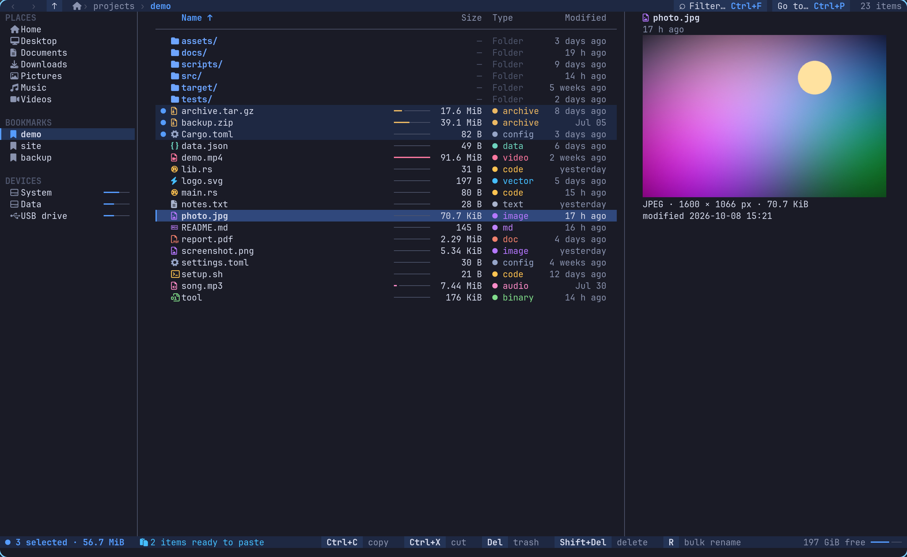

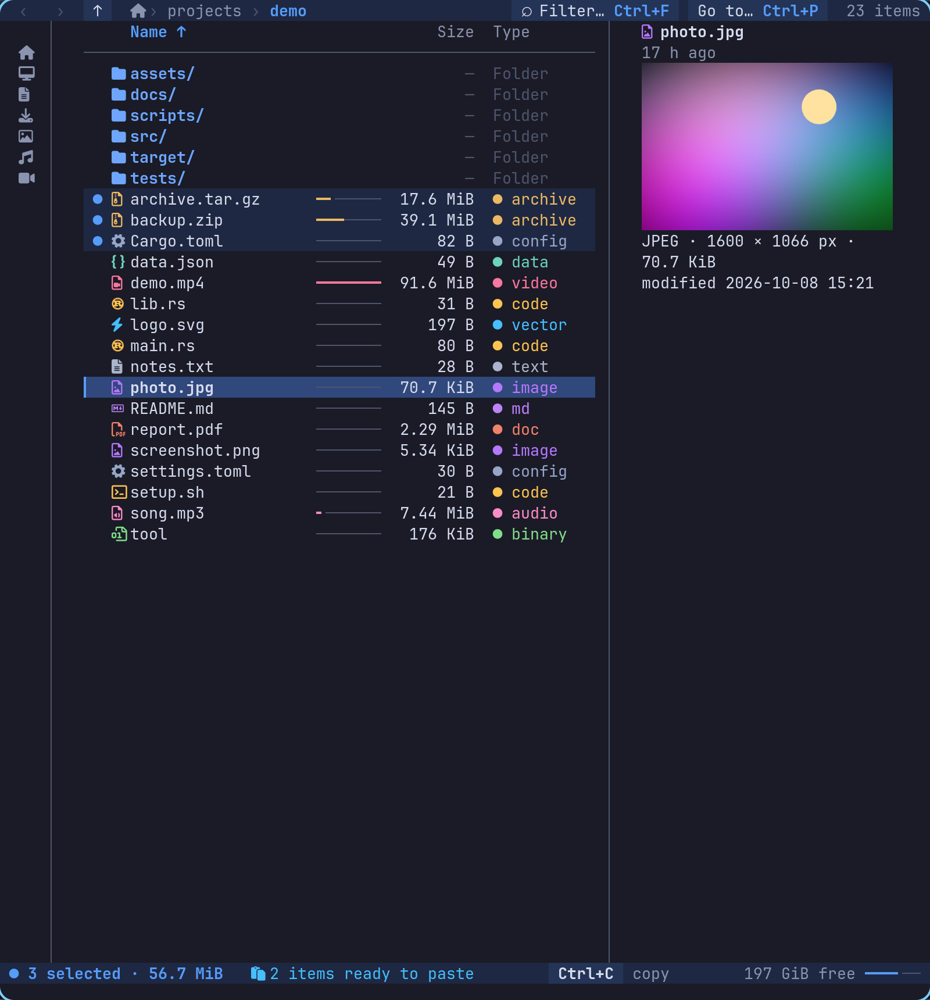

## Themes

Every colour on screen comes from a small set of named tokens (text, dim text, accent, selection, cursor row, one colour per file type, success/warning/error…). Nothing is coloured by hand elsewhere; a test reads the sources and fails if it finds a hand-written colour outside `theme.rs`, and another renders every theme and checks that each cell uses only that theme's tokens.

Three looks, each with a dark and a light variant:

| | dark | light |
|---|---|---|
| `rada` (default): calm azure on a cool neutral base | `rada-dark` | `rada-light` |
| `catppuccin` | `catppuccin-mocha` | `catppuccin-latte` |
| `tokyo-night` | `tokyo-night-dark` | `tokyo-night-day` |


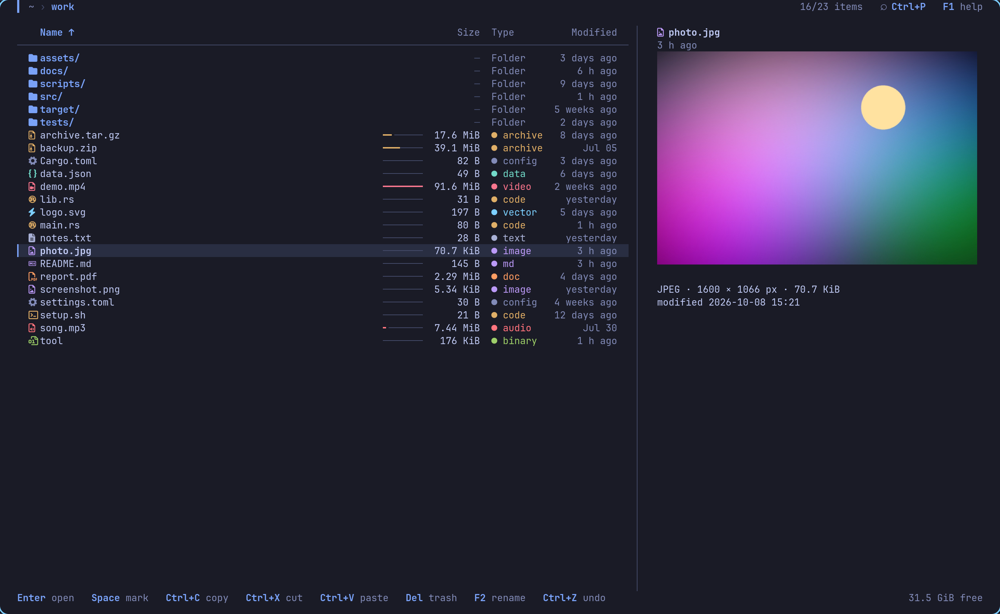
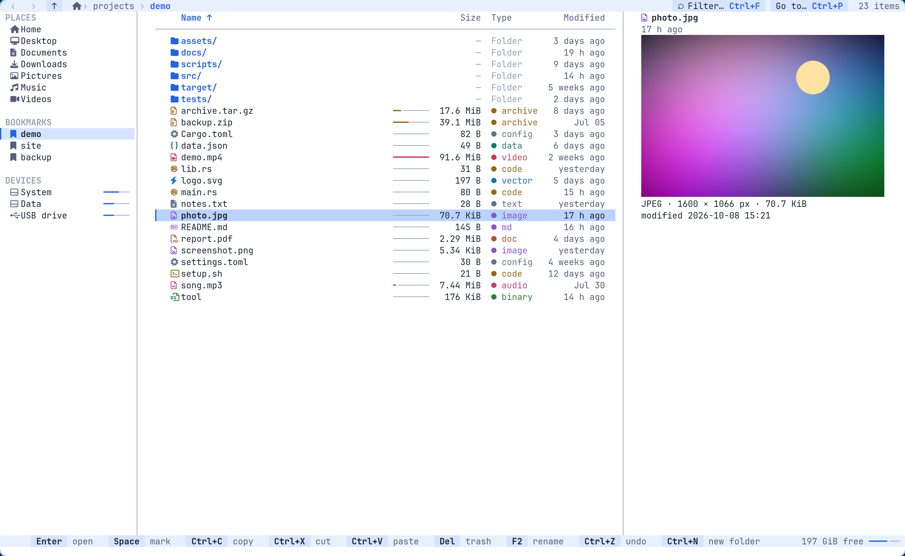

The light variants use the same tokens, chosen so they read on a pale background: automatic tests check the contrast of every token against the colour it is meant to sit on (7:1 for the main text, 4.5:1 for secondary text, accents, file types and statuses). Catppuccin Latte and Tokyo Night Day are deepened where the original colours are too pale to read as text.

**`theme = "auto"` is the default.** The names `auto`, `rada`, `catppuccin` and `tokyo-night` follow your terminal: rada finds out whether its background is light or dark and takes the matching variant. Name a variant (`theme = "rada-light"`) to pin it, or keep the name and set only the brightness: `appearance = "light"` / `"dark"` (`--appearance`, `RADA_APPEARANCE`). Choose with `theme = "…"` in the config, `--theme NAME` or `RADA_THEME`.

How rada finds out, cheapest and safest first, without ever taking a key from you:

1. what you set (`appearance`, `--appearance`, `RADA_APPEARANCE`);
2. the environment: `COLORFGBG`, the Linux console (always dark), Terminal.app on macOS (it follows the system appearance);
3. asking the terminal for its background colour (the standard OSC 11 query) with a 150 ms limit, before rada starts reading the keyboard. The query is followed by a request that every terminal answers, so once that answer is in, any answer to the colour question is in too and nothing can arrive late into your input. Keys you typed in that moment are replayed, not lost. rada does not ask under tmux unless `allow-passthrough` is on (then it asks through it), never under GNU screen or on a dumb terminal, and not when its input or output is not a terminal; `RADA_NO_TERM_QUERY=1` switches the question off;
4. otherwise: the dark theme.

The result will be shown by `rada doctor` when that command exists; until then it is written to the log (`RADA_LOG=info`). The Windows console is not asked in this version (it falls back to dark unless you set `appearance`).

Colours are true colour when the terminal supports it (`COLORTERM=truecolor`), fall back to the 256-colour palette, and to the 16 ANSI colours (with reverse video for the selection) on a basic terminal. The terminal's own background is left alone, so transparency and your wallpaper keep working; the bars and the sidebar use a slightly different tone of their own.

## Keys

Both schemes are active together by default. `keymap = "vim"` or `"classic"` keeps only one. The help (`?` or `F1`) lists every action with its keys in both schemes side by side, and always reflects your own bindings.

| Action | Vim | Classic |
|---|---|---|
| move | `j` `k` | `↓` `↑` |
| open · parent folder | `l` · `h` (and `Backspace`) | `Enter` · `←` (also `→`, and `Alt+↑` in every preset; `Backspace` is *back* here) |
| top · bottom · page | `g` `G` · `Ctrl+U` `Ctrl+D` | `Home` `End` · `PgUp` `PgDn` |
| mark and move down | `Space` | `Space`, `Ctrl+Space`, `Ins` |
| select all · extend selection | | `Ctrl+A` · `Shift+↑` `Shift+↓` (`Ctrl+Shift+Home/End` to the ends) |
| clear selection, cancel the running operation, clear filter | `Esc` | `Esc` |
| copy · cut · paste (a plan comes first) | `y` `x` `p` | `Ctrl+C` `Ctrl+X` `Ctrl+V` |
| move to trash · delete permanently (type `yes`) | `d` `D` | `Del` · `Shift+Del` |
| rename · bulk rename · new folder · new file | `r` · `R` · `n` · `N` | `F2` · — · `Ctrl+Shift+N` (also `Ctrl+N`, `F7`) · `Alt+N` |
| extract here · extract into a folder · compress | `e` · `E` · `z` | `Ctrl+E` · `Alt+E` · `Alt+Z` |
| undo · redo | `u` · `Ctrl+R` | `Ctrl+Z` · `Ctrl+Y` (or `Ctrl+Shift+Z`) |
| back · forward in the folder history | `Alt+←` · `Alt+→` (both schemes) | |
| history of operations | `U` | `F3` |
| filter this folder | `/` | `Ctrl+F` |
| jump palette (folders, recents, pinned, disks) | `m` | `Ctrl+P` |
| edit the address · refresh | `Ctrl+L` `Alt+D` `F4` · `F5` (both schemes) | |
| properties · open with… · copy path · terminal here | `i` · `O` · `Y` · `t` | `Alt+Enter` · `Alt+O` · `Ctrl+Shift+C` · `Ctrl+Alt+T` |
| tabs: new · close · next · previous · jump | `Ctrl+T` `Ctrl+W` `Ctrl+Tab` `Ctrl+Shift+Tab` `Alt+1…9` (both schemes) | |
| details pane · Details / Icons · context menu | `Alt+P` · `Ctrl+1` `Ctrl+2` or `v` · `Shift+F10` or `Menu` | |
| sort key · reverse · hidden files | `s` `S` `.` | |
| hex dump of a binary · scroll preview | `H` · `J` `K` | |
| pin this folder (or the item in the navigation pane) · home | `B` · `~` | |
| move between list and sidebar · show / hide the sidebar | `Tab` · `Ctrl+B` (both schemes) | |
| help · quit | `?` · `q` | `F1` · `Ctrl+Q` |

**`Ctrl+C` copies and never quits**: the terminal is in raw mode, so it arrives as an ordinary key, and a stray `SIGINT` is ignored. Quit with `q` or `Ctrl+Q`; `SIGTERM` and closing the terminal end rada in an orderly way (the running operation is cancelled, the terminal is restored).

**Redo** (`Ctrl+Y`) plans the operation you just undid again, and shows the usual plan window: it is the same request run through the same engine and recorded in the same journal. Redo is available until another operation is run; permanent deletions are never redoable.

In the plan window: `Enter` runs, `c` changes how name conflicts are resolved (skip existing / keep both / overwrite, where the old file goes to the trash so undo can restore it), `Tab` switches between the summary and every step, arrows scroll, `Esc` cancels. Paths are shown relative to the source and destination folders, which are named once at the top.

### Mouse

Click a name to put the cursor there; the box on its left (or `Space`) selects; double-click opens; the wheel scrolls (a turn is three rows, or one row of tiles); `Ctrl+click` adds one item and `Shift+click` selects a range. Everything drawn as a button or a field is clickable: the tabs (middle click closes), **← → ↑ ⟳**, the path segments, the search field, every button of the command bar, a column title to sort, an item of the navigation pane (right-click for *Open* and *Pin / Unpin*), the buttons of the details pane, the Details / Icons switch, every key of the hints, a row of the palette, and the buttons of any window. `mouse = false` (or `--no-mouse`) turns it all off. While rada owns the mouse, **hold `Shift` and drag to select text** in the terminal as usual. The mouse's own back and forward buttons are not reported by the terminal library (use `Alt+←` / `Alt+→`). Drag and drop is planned for a later release.

### Keys that terminals take for themselves

Checked in Ghostty by sending each combination to a real window and reading what the program received (the probe is `cargo run --example keyprobe`):

| Combination | What happens | In rada |
|---|---|---|
| `Shift+Home`, `Shift+End` | Ghostty scrolls its own scrollback and the program never sees them | `Ctrl+Shift+Home/End` extend the selection to the ends instead |
| `Shift+PgUp/PgDn`, `Ctrl+Shift+V/A/F/P/N/T/W`, `Ctrl+T`, `Ctrl+Enter`, `Ctrl+,`, `Ctrl+±/0` | Ghostty's own tabs, search, paste, fullscreen, font size | not used |
| `Shift+↑/↓` | passed on (Ghostty only uses them to adjust a text selection that exists) | extend selection; clear a terminal selection first if it seems not to work |
| `Ctrl+H`, `Ctrl+I`, `Ctrl+M`, `Ctrl+[` | the same bytes as Backspace, Tab, Enter, Esc in most terminals | not used (`Ctrl+Backspace` arrives as `Ctrl+H`) |
| `Ctrl+/` | arrives as `Ctrl+7` | not used |
| `Ctrl+S`, `Ctrl+Q`, `Ctrl+Z` | would be flow control and job control in a normal terminal | delivered as keys (raw mode); `Ctrl+Q` quits, `Ctrl+Z` undoes |
| `Ctrl+Space` | passed on | extra mark key |
| `Alt+←`, `Alt+→`, `Alt+↑`, `Tab`, `Shift+Tab`, `Ctrl+B` | passed on, intact | back, forward, parent, switch between list and sidebar (both Tab keys), show / hide the sidebar |

Everything else rada uses (`Ctrl+C/X/V/Z/Y/A/F/L/P/N/Q/B`, `Shift+Del`, `F1`–`F3`, `F7`, `Alt+←/→/↑`, `Tab`, `Ctrl+Shift+Z`, …) arrived intact. The window manager's own bindings (Hyprland here) all use the Super key, except `Alt+Space`, `Ctrl+Alt+Del` and `Ctrl+Shift+R`, which rada does not use. Terminals that implement the kitty keyboard protocol can tell more combinations apart; rada works with what every terminal sends.

## Requests as data

Every operation can be described as data and handed to the engine, with no interface involved. The request is a JSON document (`schema/request.schema.json`, generated from the Rust types and kept current by a test); the answer is a plan (`schema/plan.schema.json`). A plan produced this way goes through exactly the same confirmation window, the same executor and the same undo journal as one built with the keyboard.

```json
{ "op": "copy", "sources": ["/home/me/photos/2024"], "destination": "/mnt/backup", "conflict": "keep_both" }
```

```sh
rada --schema request            # print the JSON Schema (also: plan)
rada --request job.json          # plan it and open the usual confirmation window (`-` reads stdin)
```

Operations: `copy`, `move`, `rename`, `bulk_rename`, `make_dir`, `trash`, `delete`, `undo`. Paths must be absolute; unknown fields are refused rather than ignored. In Rust: `Engine::plan_request` (and `Jobs::plan_request` for the asynchronous version) turns an `OpRequest` into a `Plan` without touching anything; `plan_to_json` serialises it. Non-UTF-8 file names survive the round trip. Nothing runs without a confirmation: a deletion request still asks you to type `yes`.

## Desktop integration

Linux only. Everything is installed for your user, nothing needs root, and nothing is done unless you ask.

```sh
rada setup desktop                        # launcher entry and icons for this user
rada setup desktop --default-file-manager # also make rada the program that opens folders
rada setup desktop --remove               # take away exactly what was installed
```

`setup desktop` writes `rada.desktop` to `~/.local/share/applications` and the icon to `~/.local/share/icons/hicolor` (SVG, and PNG at 48, 128 and 256 px), updates the desktop database when `update-desktop-database` is available, and prints each file it wrote. The entry does not claim folders, so a plain setup never changes what opens them. With `--default-file-manager` the entry declares `inode/directory` and it uses `xdg-mime` to set rada as the handler; the previous handler is remembered and `--remove` puts it back. The launcher entry runs `rada --spawn-terminal`, which opens rada in a new terminal window, choosing in this order `xdg-terminal-exec`, `$TERMINAL`, then the first one found of ghostty, kitty, foot, alacritty, wezterm, konsole, gnome-terminal, xterm. The files to install by hand (for packagers) are in `packaging/linux/`.

## How it is built

A Cargo workspace:

- `crates/core` — filesystem model, the plan/execute/undo engine, journal, watcher, workers, platform layer. No dependency on any interface.
- `crates/tui` — the interface (ratatui + crossterm).
- `crates/rada` — the `rada` binary.

Every operation is expressed as a list of atomic **steps** (`MakeDir`, `CopyFile`, `CopySymlink`, `ExtractFile`, `Compress`, `Rename`, `TrashItem`, `RemoveFile`, …). A step knows its own inverse, so the same machinery plans, executes, journals and undoes. Everything that depends on the operating system sits behind one `Platform` trait (trash, volumes, file attributes, opening files, path rules); the engine never branches on the OS. The trait already models what Windows needs (drive letters, NTFS junctions and reparse points, hidden/system attributes, the Recycle Bin), with a complete Linux implementation and compilable stubs for Windows and macOS.

### Tests

```sh
cargo test --workspace
```

The interface is tested headlessly with real workers on a sandboxed filesystem: every action through both key schemes, simulated mouse events (click, double click, wheel, right click, modifiers), and committed text snapshots of the screens (`crates/tui/tests/snapshots/`, pinned clock and home folder; update with `INSTA_UPDATE=always cargo test -p rada-tui --test snapshots` and review the diff).

The suite includes regression tests for real bugs found in other terminal file managers: extraction into the wrong folder when a folder above has a dot in its name, `tar.xz` and `tar.bz2` that failed without an error, folders with dots in their names, symlinks (to files, to folders, broken, circular) inside copied trees, an unreadable file in a copied folder, moving and trashing across filesystems (tmpfs ↔ disk), Unicode/emoji/special/non-UTF-8 names, and undo of every kind of operation including "modified after the operation".

Tests never touch your real folders: each one runs in a temporary sandbox with `HOME` and all `XDG_*` variables pointing into it, and a guard fingerprints your real trash, config, state and cache before the first test and fails the test if anything under them changed.

CI (GitHub Actions) checks formatting and lints, runs the whole suite and builds with the minimum Rust version on Linux, and all of that must pass. It also builds the workspace and runs the core tests on Windows and macOS, but those two jobs are allowed to fail (`continue-on-error`) while platform support is in progress. Tests that are not supported yet there are marked `#[ignore = "<reason>"]`.

## Roadmap

### Next

- **Fidelity and robustness**, continuing: more ways to break the engine on purpose (other filesystems, network shares, power-loss simulation), file flags and capabilities, and fewer limits in [docs/SAFETY.md](docs/SAFETY.md).
- **Windows and macOS builds**: Recycle Bin and Trash, volumes and drive letters, junctions, attributes, with real tests on both.
- **Easy install**: signed binaries and packages for the common distributions.
- **Dual pane**, with tabs and layout restore.
- **Archives**, continuing: passwords (zip and 7z), creating 7z, keeping owners and extended attributes in the archives you make.

### Ideas, not planned yet

- **Space analysis**: find what takes up room and suggest cleanups, with an optional assistant that runs locally, is off by default and only sees names and sizes — never contents. Every suggestion would still go through the usual plan and undo.
- **Remote filesystems** (SFTP) through the same engine.
- **Plugins**.
- Git integration, syntax-highlighted preview, recursive search, a trash browser, comparing and syncing two folders with a dry-run plan.

## Contributing

Bug reports and ideas are welcome as issues; the templates ask for what helps most (version, terminal, steps). If rada ever loses or damages a file, say so first: that is the one kind of bug that matters most, and the journal (`U`) may still be able to undo it. The best thing you can do for the project is to read the operations engine and try to break it: see [CONTRIBUTING.md](CONTRIBUTING.md) for how to build, test and where help is needed.

For code: `cargo fmt --all`, `cargo clippy --workspace --all-targets -- -D warnings` and `cargo test --workspace` must pass. Changes to the look of the interface come with updated screen snapshots (`INSTA_UPDATE=always cargo test -p rada-tui --test snapshots`) whose diff you have reviewed. New operations must be expressed as plan steps that know their own inverse. Tests never touch your real folders and must keep it that way.

## License

MIT © Alessandro Formica. See [LICENSE](LICENSE).
